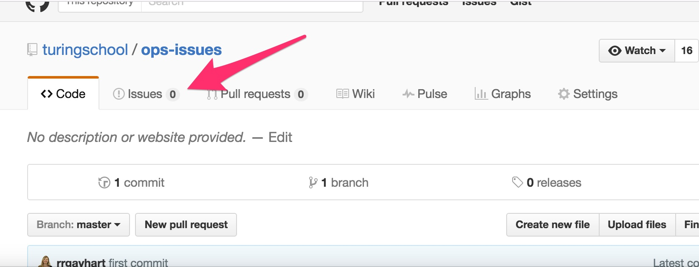
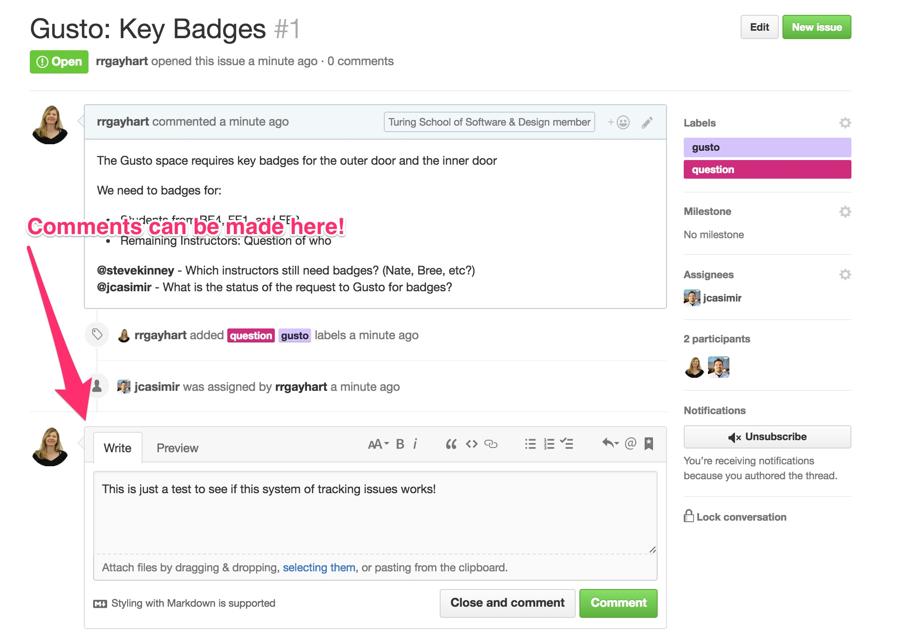

# ops-issues

A location for 'to dos' for staff and students regarding physical office locations and ops tickets.

Students can report a broken toilet.

Staff can update status on a broken toilet.

And students and staff can see the progress on the broken toilet issue.

## Set Up

### New Github Account

If you don't already have an account with Github, you can sign up for one for free.

- [Follow these directions to set up a user account](https://help.github.com/articles/signing-up-for-a-new-github-account/)
- We recommend you use your personal email address to set up this account. Github will be something you can take with you from job to job (think of it like Twitter).

### Staff: Getting Added to the Turing Organization

- If you are on staff - send your Github username and email address to someone in org or instruction to be added to the main Turing organization (you can dm @meeka).

- If you are not on staff - don't worry, you can still contribute to talking in and creating issues in this repo.

## Using Issues

### Creating an Issues

### Commenting on Issues

